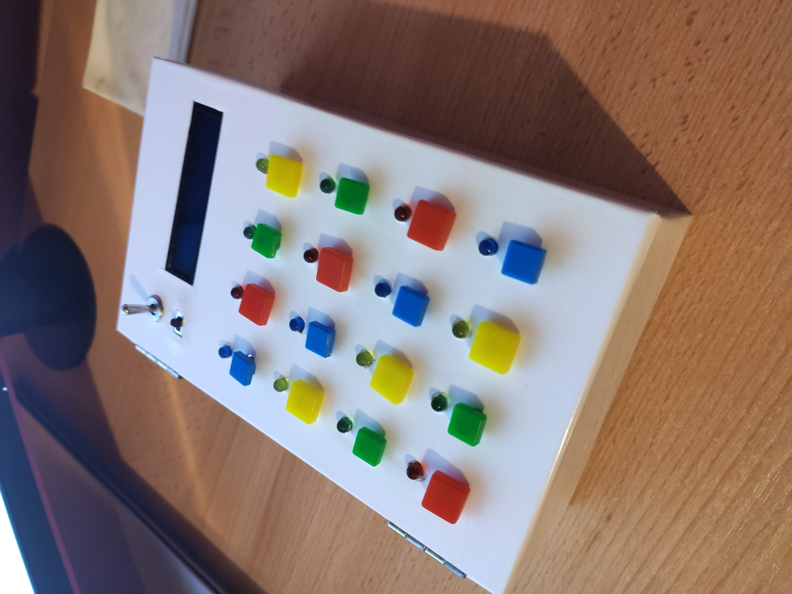
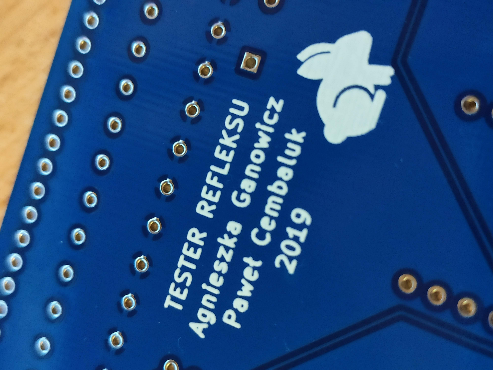
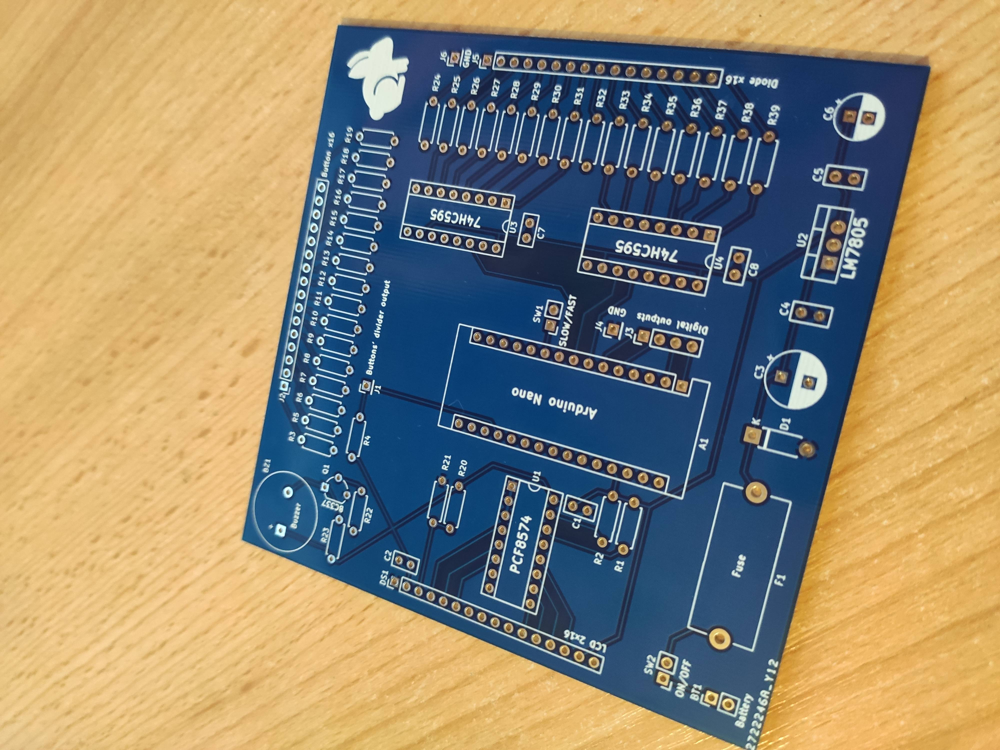
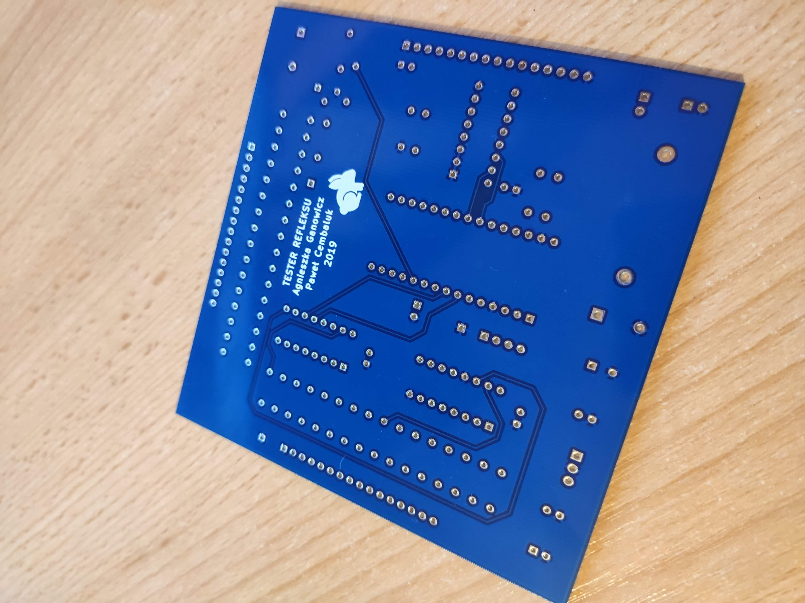

# Reflex
Reflex is a game that tests your reflex. Quite obvious, isn't it? The goal is to press a button under a diode that lights up before the time runs out. The further you get, the less time you have for reaction. 

Reflex is an Arduino project, this repository includes PCB design and C++ code.

Main features:
* Coloful LEDs and buttons.
* Information displayed on an LCD screen.
* Sound efects!
* Two difficulty levels.
* It's just fun to play :)

## Authors
* **Agnieszka Ganowicz**
* **Pawel Cembaluk**

## Built with
* [PlatformIO](https://platformio.org/)
* [Visual Studio Code](https://code.visualstudio.com/)
* [KiCad](https://www.kicad.org/)

## Photos
|  |  |
|:-----------------------------:|:------------------------------:|
|  |  |
